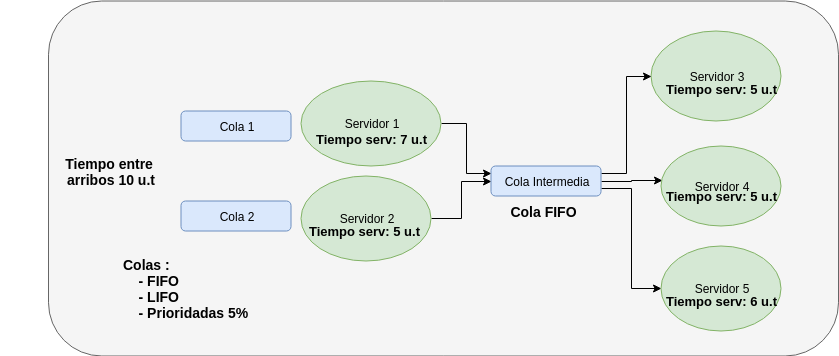

<h1 align="center">
  
</h1>
<h5 align="center">Universidad Tecnologica Nacional</h5>

# Trabajo practico integrador


## Simulación de Red de Colas

**Materia: Simulación**
**Profesor: Juan Ignacio Torres**

#### Programar en Pyhton un simulador de un sistema de res de colas como se  describe en la siguiente imagen:
_Imagen del sistema_



#### Finalizado el primer punto, se le aplico una mejora al sistema, agregandole una cola intermedia mas  rapida, a la que se le asigna el 30% de los clientes que salen de los dos primeros servidores.

### Comparacion de resultados

| Medidas | Sistema inicial | Sistema con mejora|
| :------- | :------: | -----: |
| Utilizacion servidor 1   | 70.9| 69.9|
| N° Prom clientes cola 1  | 1.79| 1.72|
| Utilizacion servidor 2   | 51.1| 50.66|
| N° Prom clientes cola 2  | 0.53 | 0.49|
| Utilizacion servidor 3   | 50.98| 53.2|
| Utilizacion servidor 4   | 30.51 | 33.61|
| Utilizacion servidor 5   | 17.5 | 19.6   |
| N° Prom clientes cola intermedia  | 0.16 | 0.08|
| N° Prom clientes cola rapida  | -- | 0.04|
| Tiempo Prom en el sistema  | 13.26| 12.48|


## Simulador Online

[M/M/C Supositorio.com](https://www.supositorio.com/rcalc/rcalclite_esp.htm)
## Clonar archivos con Git

_En caso de no tener instalado Git, descargar desde 
[aca (Descargar Git Windows)](https://git-scm.com/download/win) - Link a [pagina oficial](https://git-scm.com/downloads) de Git_

**Para instalar dejar todo por DEFAULT y poner todo "Siguiente".**

_Para Linux:_
```
 sudo apt-get install git
```

### Comando para clonar la carpeta en PC:

```
git clone https://github.com/nicomateucci/tpSimulacion
```
_Se puede hacer desde la consola de Pycharm._